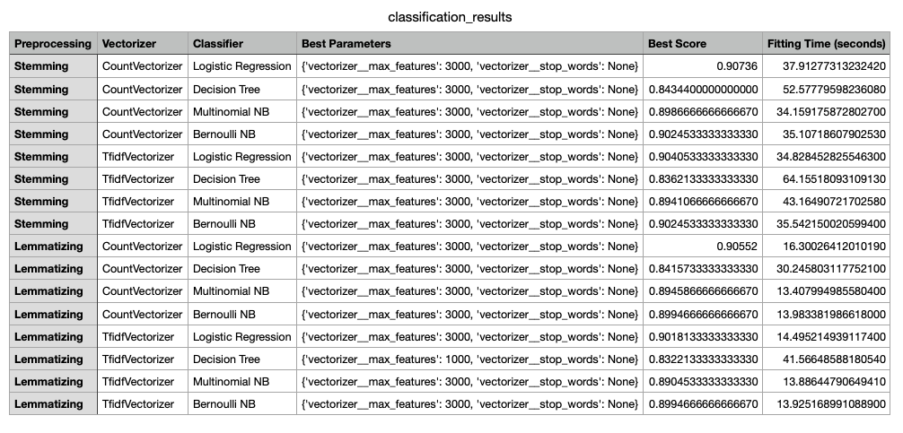
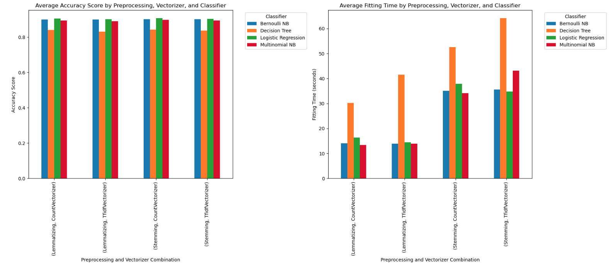

# Text Classification Model Comparison with Preprocessing

## Project Overview

This project focuses on comparing the performance of different classification models on text data using multiple preprocessing techniques. It aims to evaluate several text vectorization strategies (CountVectorizer and TfidfVectorizer) combined with different classifiers (Logistic Regression, Decision Tree, Multinomial Naive Bayes) to assess their effectiveness in terms of accuracy and speed. Additionally, it incorporates text preprocessing techniques such as stemming and lemmatizing to normalize the text data before classification.

### Dataset

The dataset used in this project contains two columns:
- `text`: The text to be classified.
- `humor`: A boolean label indicating whether the text is humorous (`True`) or not (`False`).

### Goal

The primary goal is to identify the best-performing model based on accuracy and the best parameter settings using GridSearchCV. The models will be evaluated using 5-fold cross-validation, and the results of each model will be compared based on their accuracy and time to fit the data.

---

## Project Structure

- **`TextCM.ipynb`**: The main Jupyter notebook where the entire experiment is conducted.
- **`dataset.csv`**: The full dataset containing the text and humor labels used for training and testing the models.
- **`dataset-minimal.csv`**: A minimal version of the dataset with fewer records (useful for testing purposes).
- **`README.md`**: This file, which explains the project setup, usage, and instructions.

---

## Project Overview

This project focuses on comparing the performance of different classification models on text data using multiple preprocessing techniques. It aims to evaluate several text vectorization strategies (CountVectorizer and TfidfVectorizer) combined with different classifiers (Logistic Regression, Decision Tree, Multinomial Naive Bayes) to assess their effectiveness in terms of accuracy and speed. Additionally, it incorporates text preprocessing techniques such as stemming and lemmatizing to normalize the text data before classification.

### Dataset

The dataset used in this project contains two columns:

- `text`: The text to be classified.

- `humor`: A boolean label indicating whether the text is humorous (True) or not (False).

### Goal

The primary goal is to identify the best-performing model based on accuracy and the best parameter settings using GridSearchCV. The models will be evaluated using 5-fold cross-validation, and the results of each model will be compared based on their accuracy and time to fit the data.

### Project Structure

- `TextCM.ipynb`: The main Jupyter notebook where the entire experiment is conducted.

- `dataset.csv`: The full dataset containing the text and humor labels used for training and testing the models.

- `dataset-minimal.csv`: A minimal version of the dataset with fewer records (useful for testing purposes).

- `README.md`: This file, which explains the project setup, usage, and instructions.

### Requirements

To run this project, you'll need the following libraries:

- Python 3.7+

- pandas

- scikit-learn

- nltk

- matplotlib

Additionally, you may need to download NLTK resources (for lemmatization):

### Key Steps in the Notebook

#### Text Preprocessing:

Perform both stemming using NLTK’s SnowballStemmer and lemmatizing using WordNetLemmatizer to normalize the text.

#### Vectorization:

Use CountVectorizer and TfidfVectorizer to transform text data into numerical features. Parameters like stop_words and max_features are optimized.

#### Classification:

Use Logistic Regression, Decision Tree, Multinomial Naive Bayes, and Bernoulli Naive Bayes classifiers.

Compare the classifiers using cross-validation and GridSearchCV to evaluate their performance in terms of accuracy and speed.

#### Evaluation:

##### Compare the models based on accuracy and fitting time.

Visualize the results with bar charts to understand the trade-off between accuracy and fitting time for each combination of preprocessing method, vectorizer, and classifier.

##### Results and Conclusion

After running the notebook, you will get a summary table of the best models, their parameters, and the accuracy scores. You can use this to determine the most suitable classifier for your text classification task.

##### Project Enhancements

Additional Preprocessing: In the future, you can add more advanced text preprocessing techniques, such as removing punctuation, or using more advanced vectorization strategies like word embeddings.

More Classifiers: You can extend the comparison by adding more classifiers, such as RandomForestClassifier, SVM, or even deep learning models.

### Conclusion

Based on the results presented in the classification table and visualizations, here are the key insights from the analysis:

#### Best Performance in Terms of Accuracy:

- The Logistic Regression and Multinomial Naive Bayes classifiers consistently achieved the highest accuracy scores across different preprocessing and vectorization combinations.
Lemmatizing with CountVectorizer provided slightly higher accuracy scores compared to other preprocessing techniques and vectorizers, achieving a best score of 0.90552.
Stemming and Lemmatizing both produced comparable accuracy scores when used with Logistic Regression and Multinomial NB, which suggests that both techniques are effective for this dataset.
Impact of Vectorization Techniques:

- Both CountVectorizer and TfidfVectorizer performed well in terms of accuracy, with no significant differences between them.
Using stop_words='None' and limiting the max_features to 3000 seemed to provide the best accuracy scores consistently across all classifiers and preprocessing techniques.

#### Fitting Time Analysis:

- Decision Tree Classifier consistently took the longest time to fit across all preprocessing and vectorization combinations, with fitting times exceeding 50 seconds in some cases.
Bernoulli Naive Bayes had the shortest fitting times, often around 13-16 seconds, making it the most efficient model in terms of speed.
Logistic Regression and Multinomial Naive Bayes balanced both accuracy and fitting time reasonably well.
Preprocessing Techniques:

- Lemmatizing tended to produce slightly better accuracy scores compared to Stemming, though the differences were marginal. This suggests that for this dataset, both techniques can be used effectively to normalize text.
Stemming resulted in slightly faster fitting times compared to Lemmatizing, possibly because stemming is a simpler operation that reduces words more aggressively.

#### Classifier Recommendations:

- If accuracy is the primary goal, Logistic Regression and Multinomial Naive Bayes are the recommended classifiers.
If speed is more important, especially when working with a larger dataset, Bernoulli Naive Bayes is a suitable choice.
Decision Tree Classifier did not perform as well as the others, taking significantly longer to train with a comparable or slightly lower accuracy score, making it less ideal for this problem.
Optimal Combination:

- The combination of Lemmatizing with CountVectorizer and Logistic Regression achieved one of the highest accuracy scores (0.90552) while maintaining reasonable fitting times. This makes it a robust choice for text classification on this dataset.
Multinomial Naive Bayes also performed very well with both CountVectorizer and TfidfVectorizer, achieving similar accuracy scores, providing an alternative with lower fitting times.

#### Summary:

Overall, Logistic Regression and Multinomial Naive Bayes classifiers offer the best trade-off between accuracy and fitting time for this text classification task. Lemmatizing is slightly preferred over stemming for preprocessing, as it provides a marginal boost in accuracy. The CountVectorizer and TfidfVectorizer both perform well, allowing flexibility based on preference. If fitting time is a constraint, Bernoulli Naive Bayes is the fastest option with reasonable accuracy.

#### Acknowledgments

NLTK for providing robust text preprocessing tools.

scikit-learn for making machine learning easy with its rich set of APIs for classification and model tuning.

matplotlib for providing tools to create insightful visualizations.

